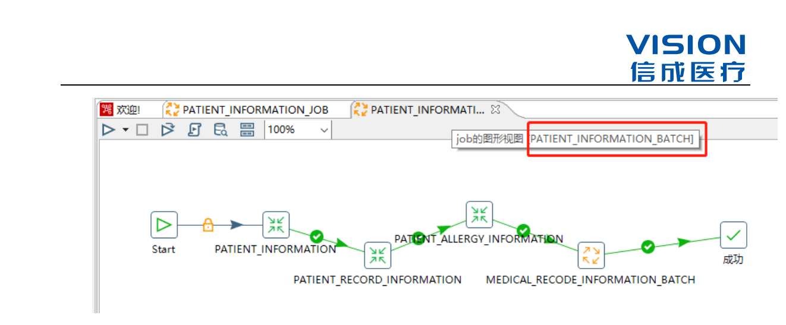

# ETL开发规范

## ETL 设计规范

### 数据集属性

此部分详细描述数据集的相关属性，包括：

字段名称——英文名称；

字段类型——含长度和精度信息；

非空属性——字段是否可以为空；

字段描述——中文名称，字段的中文解释或取值说明，如性别字段（1：男；2：女；9：不详）

### ETL 规则

此部分描述 ETL 各个环节的转换规则，包括：

* 数据源过滤规则——描述从数据源获取数据过程中的过滤掉的规则；如：过滤测试病人。根据医院要求过滤的测试病人应在作业内注释写明何人在何时要求的什么过滤规则。

* 关联规则——当源数据集为多个时，相关之间的关联关系，关联规则不明确的需跟医院确认；

* 列转换规则——描述源数据集到目标数据集的字段间的转换规则；

* 目标数据集更新规则——描述目标数据集的更新策略，包括更新机制和更新频度，如：“全量更新”、“实时更新”、“每周增量更新”等；

* ETL 作业列表——ETL 所开发的作业之间包含一定的业务逻辑和编码逻辑，所以调度过程中应遵循一定的逻辑顺序，包括：

* 作业名称——实现 Mapping 的作业名称，包括该作业功能描述，尽量做到见名知义；

* 调度顺序——用序号或者是流程图模式描述作业的调度顺序，需要综合考虑业务逻辑、编码逻辑以及系统资源等多方面情况，在保证业务逻辑和编码逻辑的基础上，通过控制调度，最大限度地合理利用系统资源；

* 参数列表——列举每个作业中所使用的参数，不同作业中的相同参数最好使用相同的名称，便于调度时进行控制；

## ETL 开发规范

### 命名规范

#### 资源库命名规范

ETL 资源库统一命名格式为：‘ETL_XXX_YYY’

备注：‘XXX’表示医院简称缩写，‘YYY’表示项目名称单词缩写例如：测试医院集成平台，即：ETL_TEST_HIP

  

#### 目录命名规范

主目录：统一命名格式为：‘XXX’，表示系统名称缩写

二级子目录：主作业统一命名格式为：‘XXX_JOB’（备份资源库作业，测试作业放二级子目录）

三级以下子目录：作业功能命名称_JOB

如：患者基本信息作业

主目录：CDR；二级子目录：CDR_JOB；三级子目录：PATIENT_INFORMATION_JOB

#### 作业命名规范（JOB）

主作业：统一命名格式为：‘XXX_JOB’ ‘XXX’表示主作业功能

如：患者基本信息作业

子业务作业：统一命名格式为：‘XXX_BATCH’ ‘BATCH’表示作业批次，可内嵌多个作业或转换
如：患者基本信息作业批次

#### 转换命名规范（TRANSFSORMATION）

统一命以‘目标表表名’命名，表名命名规则详见数据库规范

备注：数据处理涉及中间表，以 ‘原表名+_mid’后缀命名

#### 其他功能组件命名规范

其他组件命名方式统一以‘组件功能/作用描述_001’，使用多个相同组件，以‘_001’后缀递增。

#### 注释命名规范

作业的更新修改必须增加作业注释，注释内容包括：修改时间、修改人、要求修改人、修改内容等。

### 结构规范

#### 作业目录结构

目录结构的划分遵循以下原则：

1、体现作业的功能

2、体现作业的依赖关系

3、独立放置二次开发作业

## ETL 维护规范

### 日志检查

#### 运行日志

创建作业运行日志表：RUN_LOG，表结构如下：

#### 错误日志

创建错误日志表：ERROR_LOG，表结构如下：

### 错误处理

#### E 类错误

E 类错误即数据抽取阶段错误。如：数据库连接故障、网络资源不足等原因导致。

#### T 类错误

T 类错误是数据转换阶段错误。如：作业设计逻辑错误、SQL 脚本错误、Java 代码错误等。

#### L 类错误

L 类错误是数据装载阶段错误。如：主键重复、非空字段输入空值、数据类型匹配等。

### 备份、还原与版本控制

#### 运行环境备份

建议每日导出资源库作业 XML 文件，建议最少保留 7 天。

#### 数据库备份

建议数据库管理员每日做数据库的完全备份，每天保留一份备份文件，建议最少保留 7 天。

#### 版本控制

暂定使用 pdi-ce-9.1.0.0-324 版本 kettle 开发工具。
