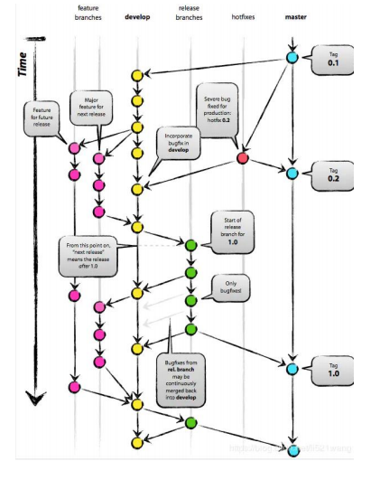
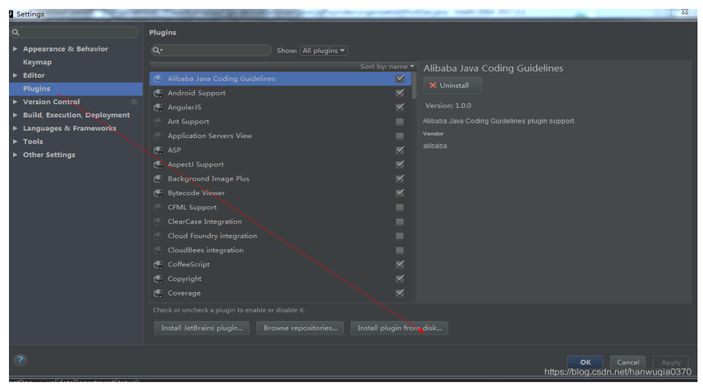
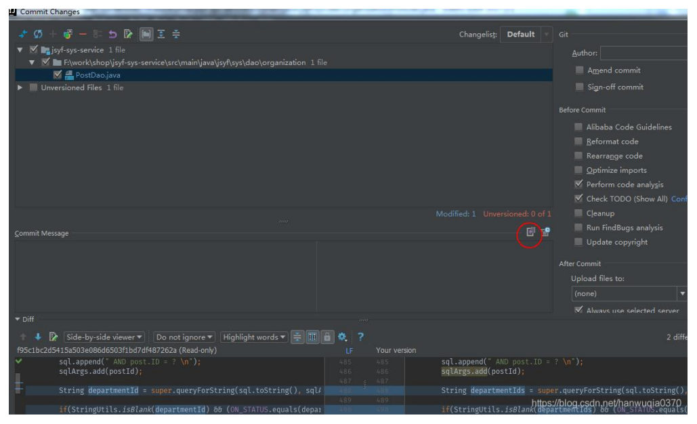
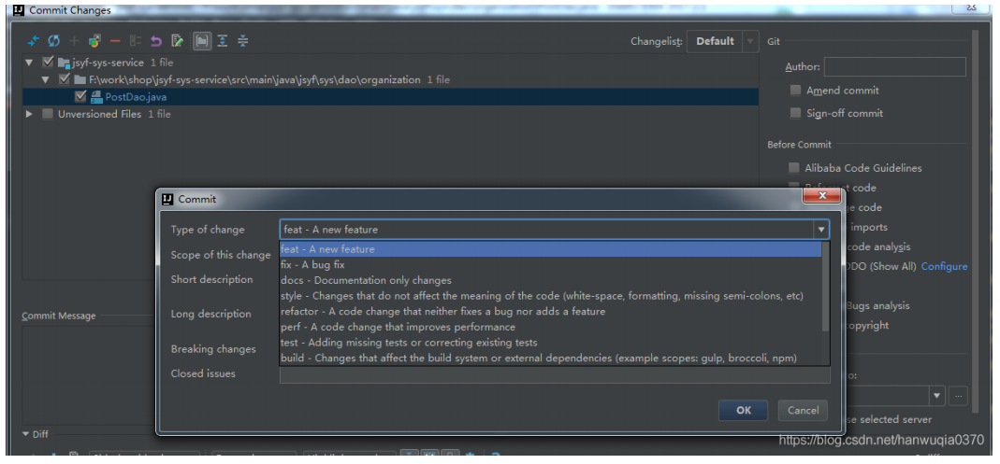
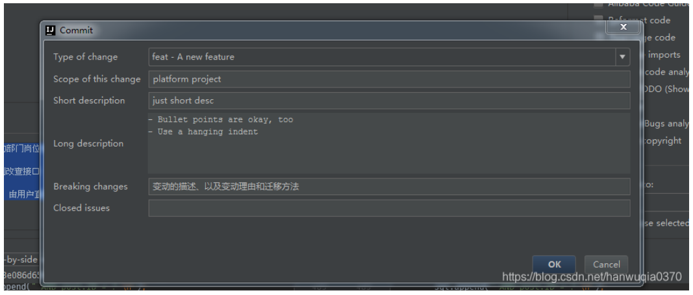
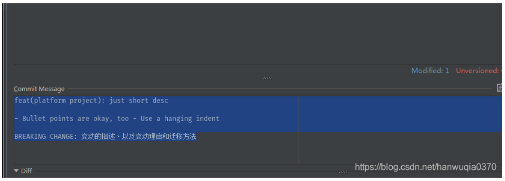

<!--
 * @Descripttion:  代码提交规范
 * @Author: zmlxsg
 * @Date: 2021-08-23 10:39:34
 * @LastEditors: zmlxsg
 * @LastEditTime: 2021-08-30 10:00:19
-->

# 代码提交规范

## 目的

规范公司开发人员提交代码的规范性，保证软件代码的完整性。

## 适用范围

公司所有软件项目。

## 涉及的干系人

项目经理：项目负责人

项目组 leader：项目组各组 leader

开发人员：项目开发全体成员

配置管理员：配置管理成员

## 代 码 提 交 规 范

### 代码分支策略

公司代码统一由 gitlab 进行管理，代码分支分为 master，develop，test 三种。配置管理人员在项目建库的时，三个分支同时建立完成。

develop 分支由开发人员，研发人员自行控制，研发人员也可在建立自己的分支，根据功能命名，在完成代码后，合并到 develop 分支中，若在提交代码的过程中产生冲突，原则是谁提交产生的冲突，谁主动与产生冲突的人员沟通，最终解决冲突，提交代码。

test 分支为项目的测试分支，在迭代周期内，开发人员提交合并申请后，具体由配置管理人员负责合并，并启动 Jenkins 进行代码编译。

master 分支为项目的主线分支，在软件测试验证通过后合并代码，具体由配置管理人员负责合并。
Tag 由公司配置管理进行管理，在研发人员提出发布申请后，由配置管理从最新的 master 分支上取出最新代码进行编译，编译通过以后建立软件版本对应标签。

### 代码提交规范及频率

* 在代码提交到 develop 前，开发人员一定是在本地编译通过的代码。
* 为避免冲突的频繁产生，原则上规定开发人员每天下班前把已完成的代码提交到 develop 分支中，每天上班前拉取最新代码。因此规定开发人员的代码提交频率至少为每天一次。

### 代码提交日志规范

* 为了保证使用 git 的日志提交一致，现规定格式规范如下：

      <type>[<scope>]: <subject> //本行内容 git 在 push 到中央仓库时会被校验
      //空行
      <body>
      //空行
      <footer>

注意：type 后若使用英文冒号，请多加一个空格。

* 类型解释

type

用于说明 commit 的类别，只允许使用下面 7 个标识，必传。

    feat：新功能（feature）
    fix：修补 bug
    docs：文档（documentation）
    style： 格式（不影响代码运行的变动）
    refactor：重构（即不是新增功能，也不是修改 bug 的代码变动）
    test：增加测试
    chore：构建过程或辅助工具的变动

scope

用于说明 commit 影响的范围，比如数据层、编译期等等，视项目不同而变化，可选的。

subject

commit 提交目的的简短描述，不少于 10 个字符,，必传。

body

是对本次 commit 的详细描述，可以分成多行，可选的，一般不传。

footer

此处一般有两种情况，可选的，一般不传：

1. 与上一版本不兼容的变动，应说明变动的描述、以及变动理由和迁移方法。
2. 如果当前 commit 针对某个 issue(gitlab 上所提出的，我们一般用不到，因为我们的 bug 都提交在了禅道上)，那么可以在 Footer 部分关闭这个 issue。

* IDEA 插件安装使用
* 安装方法一: 在 setting-plugins-marketplace 中查询 git commit template 随后安装并重启 idea
* 安装方法二: 安装文件夹中的 git_commit_template.jar 的插件（选择从硬盘安装），随后重启 idea

* 提交代码在安装成功后，commit 页面会多出如下红圈标注的可点击图标，请不要再图标左下侧的文本区域进行注释编写，务必点击此按钮。

* 在点击按钮后，会出现如下弹窗：

* 左边的每个选型分别对应上述规则。在选择填写完成后，会自动生成符合格式的提交文本，如下：

* VsCode 插件安装使用
* VsCode 安装 Visual Studio Code Commitizen Support 插件
* 项目中安装插件 `npm i -D @commitlint/cli`
* 在项目更目录下建立配置文件 commitlint.config.js 或者 .commitlintrc.js

      module.exports = {
      extends: ["cz"],
      rules: {
      // must add these rules
      "type-empty": [2, "never"],
      "subject-empty": [2, "never"],
      },
      };

* 结合 git hook 来检验 commit message,这样当你的提交不符合规范时就会阻止你提交 `npm i -D husky`

  package.json 中加入下面内容:

  "husky": {
  "hooks": {
  "commit-msg": "commitlint -E HUSKY_GIT_PARAMS"
  } }

* 项目中安装插件 npm i -D commitlint-config-cz cz-customizable， 并且在项目根目录创
建 .cz-config.js 文件，文件内容如下：

      module.exports = {
      types: [ {value: '✨特性', name: '特性: 一个新的特性'},
      {value: '🐛修复', name: '修复: 修复一个 Bug'},
      {value: '📝文档', name: '文档: 变更的只有文档'},
      {value: '💄格式', name: '格式: 空格, 分号等格式修复'},
      {value: '♻ת重构', name: '重构: 代码重构，注意和特性、修复区分开'},
      {value: '⚡؎性能', name: '性能: 提升性能'},
      {value: '✅测试', name: '测试: 添加一个测试'},
      {value: '🔧工具', name: '工具: 开发工具变动(构建、脚手架工具等)'},
      { value: ''回滚', name: '回滚: 代码回退' }
      ],
      scopes: [ {name: '模块 1'},
      {name: '模块 2'},
      {name: '模块 3'},
      {name: '模块 4'}
      ],
      // it needs to match the value for field type. Eg.: 'fix'
      /* scopeOverrides: {
      fix: [
      {name: 'merge'},
      {name: 'style'},
      {name: 'e2eTest'},
      {name: 'unitTest'}
      ]
      }, */
      // override the messages, defaults are as follows
      messages: {
      type: '选择一种你的提交类型:',
      scope: '选择一个 scope (可选):',
      // used if allowCustomScopes is true
      customScope: 'Denote the SCOPE of this change:',
      subject: '短说明:\n',
      body: '长说明，使用"|"换行(可选)：\n',
      breaking: '非兼容性说明 (可选):\n',
      footer: '关联关闭的 issue，例如：#31, #34(可选):\n',
      confirmCommit: '确定提交说明?'
      },
      allowCustomScopes: true,
      allowBreakingChanges: ['特性', '修复'],
      // limit subject length
      subjectLimit: 100
      };

package.json 中加入以下两段内容 :

    "config": {
    "commitizen": {
    "path": "cz-customizable"
    } }
    "scripts": {
    "commit": "git cz"
    }
