<!--
 * @Descripttion: 测试规范
 * @Author: zmlxsg
 * @Date: 2021-08-23 10:39:34
 * @LastEditors: zml
 * @LastEditTime: 2021-10-14 12:01:56
-->

# 测试规范

## 软件安全测试工作指南

### 概述

#### 编写目的

建立和完善软件系统安全测试管理制度。规范软件系统安全测试各环节的要求、规范各岗位人员的工作职责、明确软件系统安全测试实施过程中的管理行为及文档要求。以规范化的文档指导软件系统安全测试工作，提升管理效率、降低项目风险。

#### 适用范围

本规范适用于智能信息化系统建设项目软件安全测试管理过程。
需要进行安全测试的原因：

* 应用系统参与研发人员多，系统代码量大
* 系统升级、人员变更，代码规范难统一
* 多个 Web 系统共同运行于同一台服务器上
* 开发人员未经过安全编码培训或者公司根本就没有统一的安全编码规范
* 测试人员经验不足或者没经过专业的安全评估测试就发布上线
* 用户输入缺乏验证

#### 项目背景

医院系统信息化软件众多，这些软件不光承载着医院核心业务，同时还生成、处理、存储着医院的核心敏感信息：账户、隐私、科研、薪资等，一旦软件的安全性不足，将可能造成业务中断、数据泄露等问题的出现。希望通过规范软件系统安全测试管理，改善和提高医院软件安全测试水准，将医院软件系统可能发生的风险控制在可以接受的范围内，提高系统的安全性能。

#### 参考资料

国家政策性文件：

1. GB/T 22239—2018 信息安全技术网络安全等级保护基本要求
2. GB/T 22239—2019《网络安全等级保护基本要求》标准解读
3. WS_T 447-2014 基于电子病历的医院信息平台技术规范(安全规范部分)
4. WS/T 448-2014 基于居民健康档案的区域卫生信息平台技术规（安全规范部分）
5. IBM Security AppScan Standard 版本：9.0.3.13 构建：19712 安全规则版本：19712

#### 安全测试流程

软件系统安全测试流程分为 7 个阶段：

1. 测试准备：确定测试对象、测试范围、测试相关人员权责；
2. 测试方案：按要求整理撰写《安全测试方案》 ，并完成方案审批；
3. 测试计划：测试方案通过后，协调确认各相关人员时间，形成测试计划；
4. 实施测试：按计划实施软件安全测试工作，输出《软件安全测试报告》
5. 回归测试：待研发完成《软件安全测试报告》中问题及漏洞的修复工作后，安全实施团队确认修复工作，并确认是否引入了新的问题；问题修复&回归测试是个循环的过程，测试没有新的问题时循环即终止；
6. 研发修复验证 2 次不通过，直接将安全测试工具提交给研发，要求研发自测。
7. 测试总结：测试过程总结，输出文档评审，相关文档归档。

其整体流程见流程图，下图 ：

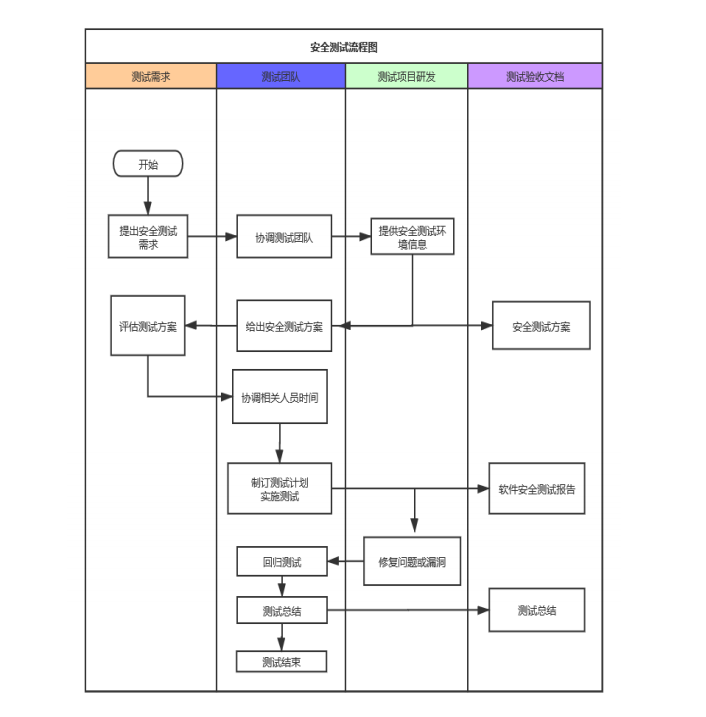

#### 测试方案

安全测试团队根据软件构成、软件环境以及安全需求编制《X 软件系统安全测试方案》 ；软件系统安全测试方案至少要覆盖以下内容：

1. 测试工具: AppScan v10.0.4
2. 测试准备（对象、范围、分工）
3. 测试分析（系统分析、威胁分析）
4. 实施测试方法
5. 回归测试方法

### 安装 AppScan

1、右键安装文件，以管理员身份运行，如下图所示：

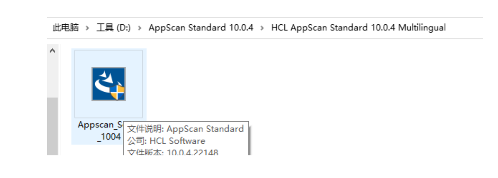

2、一路点击【确定】，【安装】到该目录

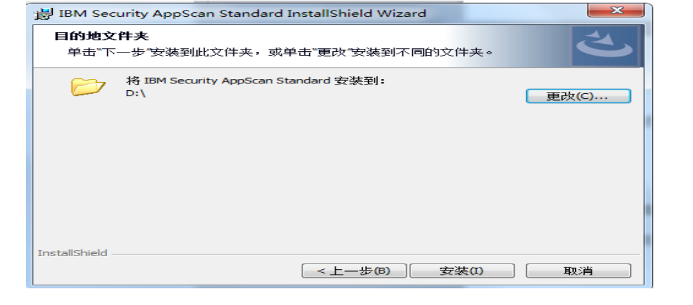

3、如果需要扫描 Web services，点击【是】安装该插件，如果不需要点击【否】；如果只是扫描 web 就不需要安装

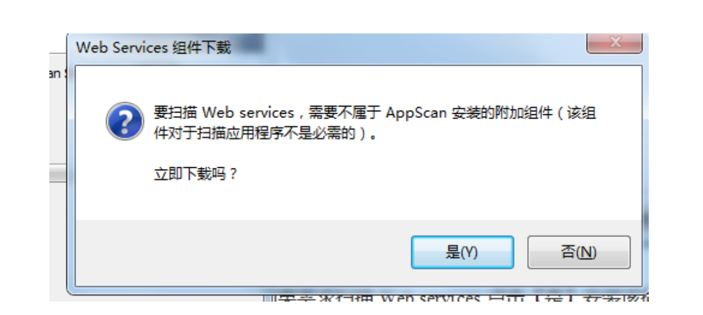

4、安装完成之后把 LicenseProvider.dll（破解文件）文件复制放到安装目录下覆盖原来的，路径在一级目录下

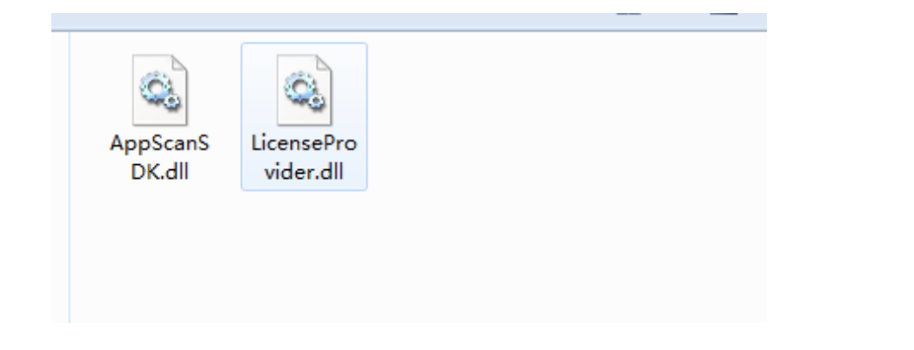

### 工作基本流程

在我们开始扫描之前，让我们对 Appscan 的工作做一个了解，任何自动化扫描器都有两个目标：找出所有可用的链接和攻击寻找应用程序漏洞。

1.探索(Explore)：

探索阶段, Appscan 试图遍历网站中所有可用的链接，并建立一个层次结构。它发出请求，并根据响应来判断哪里是一个漏洞的影响范围。例如，看到一个登陆页面，它会确定通过绕过注入来通过验证。在探索阶段不执行任何的攻击，只是确定测试方向。这个阶段通过发送的多个请求确定网站的结构和即将测试的漏洞范围。

2.测试(Test) ：

在测试阶段，Appscan 通过攻击来测试应用中的漏洞，通过释放出的实际攻击的有效载荷，来确定在探索阶段建立的安全漏洞的情况，并根据风险的严重程度排名。在测试阶段可能会发现网站的新链接，因此 Appscan 在探索和测试阶段完成之后会开始另一轮的扫描，并继续重复以上的过程，直到没有新的链接可以测试。扫描的次数也可以在用户的设置中配置。

3.AppScan 测试覆盖项说明自动化测试工具 AppScan 满足如下测试项：

* 参数操作

跨站脚本

SQL 注入

代码执行

文件包含

脚本源代码检查

CRLF 注入

CrossFrameScripting(XFS)

PHP 代码注入

XPath 注入

全路径泄漏

LDAP 注入

Cookie 操作

* 文件检查

检查备份的文件及目录

URI 中的跨站脚本

检查脚本错误

* 目录检查

查找常见的文件

发现敏感的文件和目录

发现存在弱权限控制的目录
路径和 SESSIONID 中的跨站脚本

* 文本搜索

目录列表

源代码泄漏

注释信息搜索

常见文件检查

Email 地址收集

本地路径泄漏

错误信息

* SessionFixation（会话固定）

* GoogleHacking

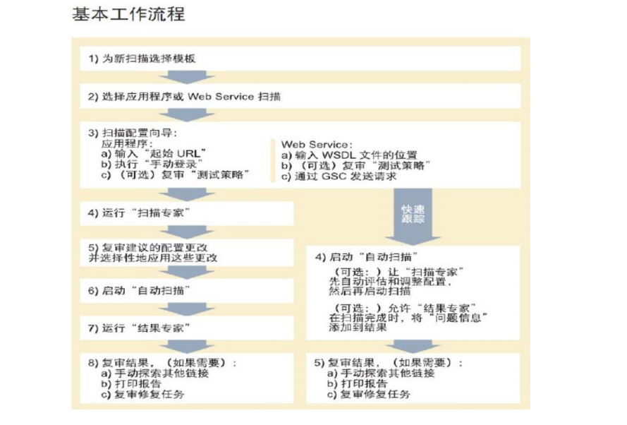

### 使用步骤

1、打开 AppScan 软件，点击工具栏上的 文件±>新建，输入扫描项目目标 URL

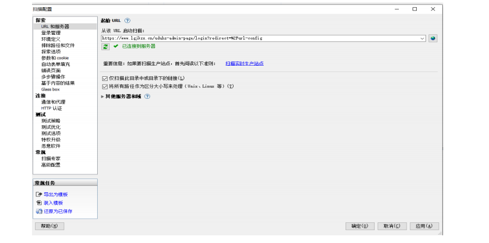

2、点击”下一步“，选择认证模式，出现登录管理的页面，记录选择 chromium 浏览器，这是因为对于大部分网站，需要用户名和密码登录进去才可以查看许多内容，未登录的情况下就只可以访问部分页面。【用于登录测试项目站点的用户名及密码,例如：用户名：admin 密码：12345】

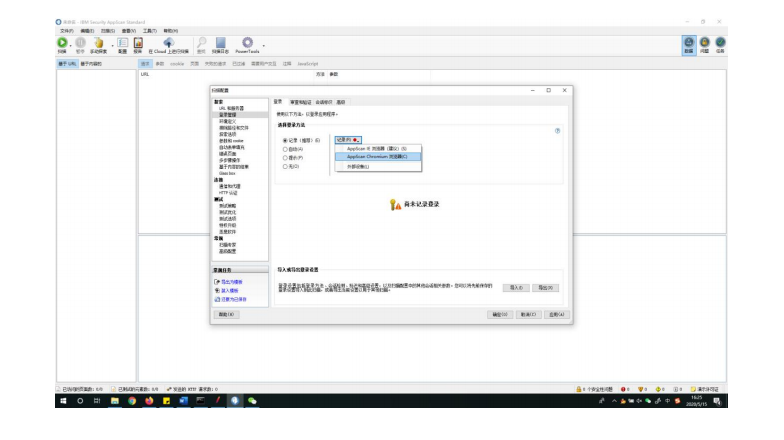


3、 点击“下一步”，出现测试策略页面，可以根据不同的测试需求进行选择，此处选择“完成”策略。

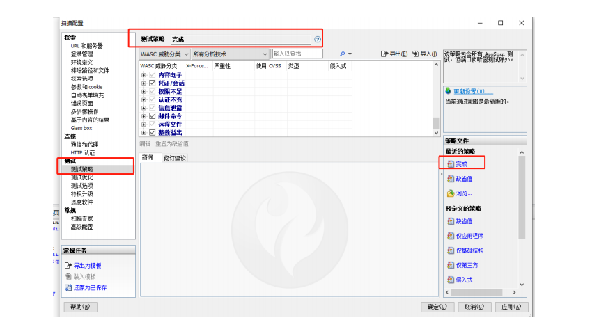

4、 点击“完成”，设置保存路径，即开始扫描，如下图：

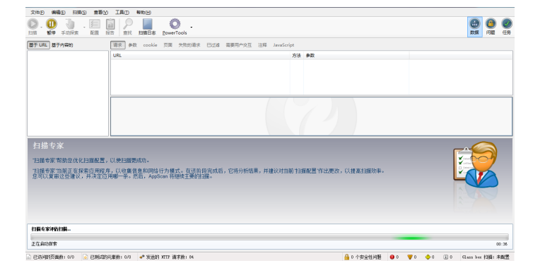

### 扫描设置

在测试策略中，有多种不同的分组模式，最经常使用的是“严重性”，“类型”，“侵入式”、“WASC 威胁分类”等标准，根据不同分组选择的扫描策略，最后组成一个共同的策略集合。测试策略选择步骤如下：

1. 选择缺省的扫描策略

切换到按照“类型”分类，取消掉“基础结构”和“应用程序”两种类型。说明：把扫描策略置空，没有选择任何的扫描策略。在分组类型中选择“类型”分类，类型分类中只有两种类型：“基础结构”和“应用程序”，可以快速全部都取消掉。

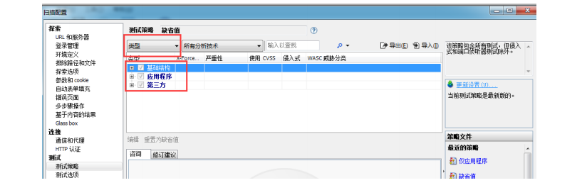

2.分组类型

1)切换到“WASC 威胁分类”，选择“SQL 注入”和“跨站点脚本编制”。

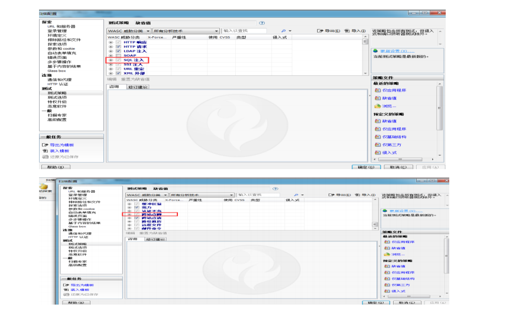

2)切换到“类型”，发现这时候“基础结构”和“应用程序”两种类型的扫描策略都是选择上的模式，而且是虚线，说明这两种类型下均有部分扫描策略被选择了，我们不关心“基础结构”级别的安全问题，所以在这里取消“基础结构”。

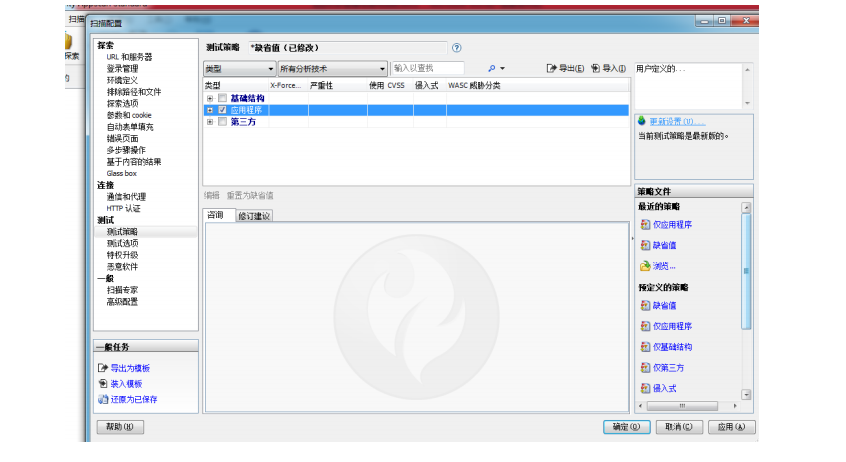

3)切换到“侵入式”，发现这时候“侵入式”和“非侵入式”两种类型的扫描策略都是选择上的模式。“侵入式”会有有比较强的副作用，可能对系统造成伤害，所以一般扫描生产系统的时候，很少选择。这里把“侵入式”的用例取消掉。

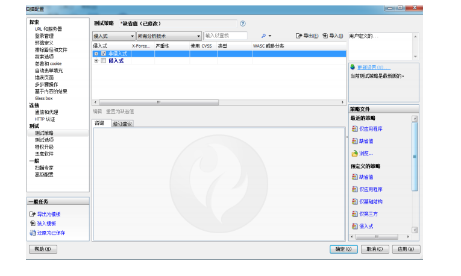

3.环境定义按照需求来选择

如下图：


4.选择线程与超时时间设置避免超时时会话中断而停止。

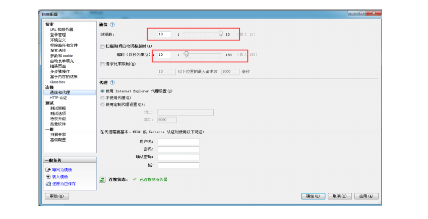

5.扫描专家配置
如果扫描中遇到检测到会话外的连接，可以适当的调整扫描专家选项。

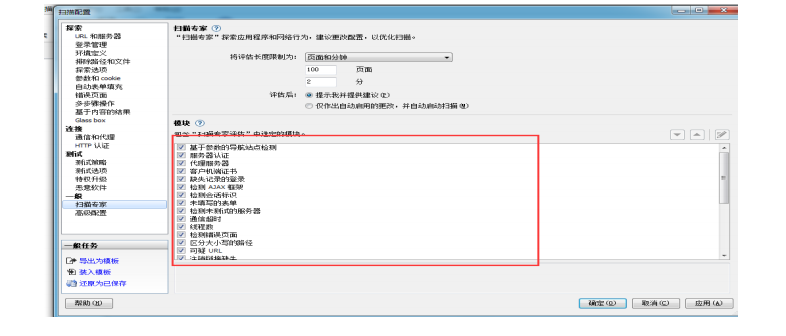

6.扫描完成输出报告,点击问题查看，点击“报告”导出 pdf.

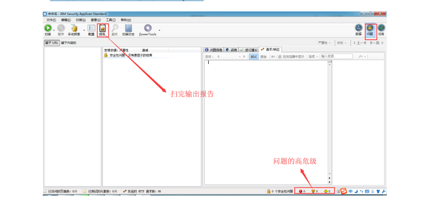

### 安全测试报告

#### 报告关注指标

* 高严重性问题
* 中等严重性问题
* 低严重性问题
* 参考严重性问题
* 报告中包含的严重性问题总数
* 主要需要修复的问题

#### 安全报告通过标准

|漏洞等级|个数|结果|测试人|
|---|---|---|---|
|高危漏洞 |无 |通过 |XXX|
|中危漏洞 |无 |通过 |XXX|
|低位漏洞 |实际个数 |参考| XXX|
|参考漏洞 |实际个数 |参考| XXX|

## 性能测试基准

### 概 述

#### 编 写 目 的

本文档在对性能指标的概念、测试及分析方法、评判标准以及工具的使用进行说明，旨在指导性能测试工程师更好的理解各个性能指标，并对系统的性能质量做出准确的评价和分析。

#### 适 用 范 围

本基准适用范围：信成医疗销售招标，软件开发、软件测试和软件评测。

#### 参 考 资 料

行业标准性文件：

1. WST 447-2014 基于电子病历的医院信息平台技术规范
2. WST 448-2014 基于居民健康档案的区域卫生信息平台技术规范
3. WST 517-2016 基层医疗卫生信息系统基本功能规范
4. WST 529-2016 远程医疗信息系统基本功能规范

### 产品性能指标

#### 电子病历的医院信息平台

##### 最小并发用户数

最小并发用户数要求包括：

---对二级医院基于医院信息平台的应用系统，总的允许最小并发用户数大于 200；

---对三级医院基于医院信息平台的应用系统，总的允许最小并发用户数大于 600；

##### 基础服务平均相应时间

基础服务平均响应时间要求包括：

|测试内容|评测指标|响应时间|
|---|---|---|
|基础服务|个人注册服务调用：单个患者注册平均相应时间小于 1s;|小于 1s|
||个人基本信息查询：总记录 50 万以上，按照患者唯一标识查询平均相应时间小于 2s；总记录 100 万以上，按照患者唯一标识查询平均相应时间小于 3s;|50 万以上 100 万以下，小于 2s.100 万以上，小于 3s|
||基于人口统计学信息的患者信息匹配(基于索引): 总记录 50 万以上，返回患者唯一标识数据，返回记录数小于 10 条时，平均相应时间小于 10s；总记录 100 万以上，返回患者唯一标识数据，返回记录数小于 10 条时，平均相应时间小于 15s；|50 万以上 100 万以下，小于 10s；100 万以上，小于 15s.|

##### 电子病历整合服务平均响应时间

电子病历整合服务平均响应时间要求包括：

|测试内容|评测指标|响应时间|
|---|---|---|
|电子病历整合服务|就诊信息查询：总记录 50 万以上，按患者唯一标识查询，单个患者查询平均相应时间小于2s；总记录 100 万以上，按患者唯一标识查询，单个患者查询平均相应时间小于3s；|50 万以上 100 万以下，小于 2s100 万以上，小于 3s|
||就诊信息接收： 单个患者就诊信息保存平均相应时间小1s|小于 1s|
||医嘱信息查询: 总记录 500 万以上，按患者就诊号（一次就诊标识号）查询，返回记录数小于 10条总记录 1000 万以上，返回记录数小于 10条|50 万以上 100 万以下，平均相应时间小于 3s100 万以上，平均相应时间小于 4s|
||医嘱信息接收： 每次提交小于 10 条时 |平均相应时间小于 3s|
||申请单查询服务：按一个申请单标识号查询 |平均相应时间小于 2s|
||申请单接收服务：平均响应时间小于 2s； |平均相应时间小于 2s|
||预约查询服务： 按一个预约标识号查询 |平均响应时间小于 2s|
||预约接收服务： 平均响应时间小于 1s |平均响应时间小于 1s|
||结果查询服务： 按一个结果标识号查询，| 平均响应时间小于 2s|
||结果接收服务： 平均响应时间小于 2s |平均响应时间小于 2s|

##### 电子病历档案服务平均响应时间

电子病历档案服务平均响应时间要求包括：

|测试内容|测评指标|响应时间|
|---|---|---|
|电子病历档案服务|电子病历文档存储服务：提交单个模板电子病历文档实例 |平均响应时间小于 1s|
||电子病历文档索引查询：按患者唯一标识查询，返回患者电子病历文档目录树|平均响应时间小于 2s|
||电子病历文档查询: 按电子病历文档标识查询|5 平均响应时间小于2s|

#### 居民健康档案的区域卫生信息平台

##### 最 小 并 发 用 户 数

最小并发用户数要求包括：

对于区域卫生信息平台的服务，最小并发用户数要求：

---人口≤100 万，允许每分钟最小并发用户数宜≥400 个；

---100 万≤人口≤ 500 万，允许每分钟最小并发用户数宜≥1800 个；

##### 基 础 服 务 平 均 相 应 时 间

<table>
    <tr>
      <th>测试内容</th>
      <th colspan="2">测评指标</th>
      <th>平均响应时间</th>
    </tr>
    <tr>
        <td rowspan="6">基础服务</td>
        <td colspan="2">患者注册服务调用：单个患者注册</td>
        <td>小于 1s</td>
    </tr>
    <tr>
        <td colspan="2">健康档案查询： 按患者唯一标识查询，返回患者电子健康档案文档目录树时。</td>
        <td>小于 2s</td>
    </tr>
    <tr>
        <td rowspan="2">患者基本信息查询：</td>
        <td>总记录 50 万以上，按患者唯一标识查询单个患者.</td>
        <td>小于 2s</td>
    </tr>
    <tr>
        <td>总记录 100 万以上，按患者唯一标识查询单个患者.</td>
        <td>小于 3s</td>
    </tr>
    <tr>
        <td rowspan="2">基于人口统计学信息的患者信息匹配(基于索引):</td>
        <td>总记录 50 万以上，返回患者唯一标识数据，返回记录数小于 10 条时</td>
        <td>小于10s</td>
    </tr>
    <tr>
        <td>总记录 100 万以上，返回患者唯一标识数据，返回记录数小于 10 条时</td>
        <td>小于15s</td>
    </tr>
</table>

##### 健康档案交换服务性能

健康档案交换服务性能要求包括：

---单记录交换/入库的平均响应时间≤20ms；

---批量数据上传：峰值 800 笔/min.

##### 健康档案调阅服务性能

健康档案交换服务性能要求包括：

---千万级数据量下单记录本地查询的响应时间≤2s；

---千万级数据量下分布查询的响应时间≤5s/次；

##### 健康档案协同服务性能

健康档案协同服务性能要求：

---健康档案协同服务响应：峰值 30 笔/S；

---健康档案协同接受服务请求时间≤2s；

---健康档案协同发送业务服务时间≤5s；

##### 统计分析性能

统计分析性能要求包括：

---简单统计报表查询：响应时间≤10s；

---千万级数据量下单项统计的响应时间≤5s；

---复合汇总统计响应时间≤120s；

---生成复杂统计报表的响应时间≤180s；

#### 基层医疗卫生信息系统基本功能规范

暂无性能指标

#### 远程医疗信息系统基本功能规范

暂无性能指标

### 通用性能指标

#### 要求

性能指标要求优先根据产品提供的需求规格说明文档中的性能要求部分执行；
若需求规格说明文档未对该部分作出描述，则以当前硬件资源的测试结果作为参考，是否通过由项目组决定。

性能测试场景由产品负责人提供。

#### 平均响应基准

请求响应时间指的是从客户端发起的一个请求开始，到客户端接收到从服务器端返回的响应结束，这个过程所耗费的时间，响应时间的单位一般为“秒”或者“毫秒”。一个公式可以表示：响应时间＝网络响应时间+应用程序响应时间。平均响应时间=所有样本响应时间之和/样本总数；下面是公司内部参考原则（平均响应时间，单位秒）：

性能测试基准遵循 2/5/8 原则

（1）在 2 秒钟之内，页面给予用户响应并有所显示，可认为是“很不错的”；

（2）在 5 秒钟内，页面给予用户响应并有所显示，可认为是“好的”；

（3）在 8 秒钟内，页面给予用户响应并有所显示，可认为是“勉强接受的”；

（4）超过 8 秒就让人有点不耐烦了，用户很可能不会继续等待下去；

#### 并发计算公式

在实际性能测试中，测试人员需要从业务角度出发计算同时在线用户数量，即设置多少个并发数比较合理。，以下是一个估算并发用户数的方法：

（1） 计算平均的并发用户数： C = nL/T

（2） 并发用户数峰值： C’ ≈ C+3 根号 C

公式（1）中，C 是平均的并发用户数；n 是 login session 的数量；L 是 loginsession 的平均长度；T 指考察的时间段长度。

公式（2）则给出了并发用户数峰值的计算方式中，其中，C’指并发用户数的峰值，C 就是公式（1）
中得到的平均的并发用户数。该公式的得出是假设用户的 loginsession 产生符合泊松分布而估算得到的。

实例：假设有一个 OA 系统，该系统有 3000 个用户，平均每天大约有 400 个用户要访问该系统，对一个典型用户来说，一天之内用户从登录到退出该系统的平均时间为 4 小时，在一天的时间内，用户只在 8小时内使用该系统。

则根据公式（1）和公式（2），可以得到：

C = 400*4/8 = 200

C’≈200+3*根号 200 = 242

备注：以上并发计算公式只使用于服务环境为集群模式；如果是单机服务，则以当前硬件资源的测试结果为参考，是否通过由项目组决定。

#### 硬件资源指标

资源利用率指的是对不同的系统资源的使用程度，例如服务器的 CPU 利用率，磁盘利用率等。资源利用率是分析系统性能指标进而改善性能的主要依据，因此是 WEB 性能测试工作的重点。

资源利用率主要针对 WEB 服务器，操作系统，数据库服务器，网络等，是测试和分析瓶颈的主要参考。 在 WEB 性能测试中，需要采集相应的参数进行分析。

系统的瓶颈定义

|性能项|命令|指标|
|---|---|---|
|CPU 限制| vmstat |当%user+%sys 超过 80%时|
|磁盘 I/O 限制| Vmstat|当%iowait 超过 40%(AIX4.3.3 或更高版本) 时|
|应用磁盘限制| Iostat |当%tm_act 超过 70%时|
|虚存空间少 |Lsps，-a |当分页空间的活动率超过 70%时|
|换页限制 |Iostat, stat|虚 存逻辑 卷 %tm_act 超 过 I/O(iostat)的30%，激活的虚存率超过 CPU 数量(vmstat)的 10 倍时|
|系统失效 |Vmstat, sar |页交换增大、CPU 等待并运行队列|

稳定系统的资源状态

  <table>
    <tr>
        <td>性能项</td>
        <td>资源</td>
        <td>评价</td>
    </tr>  
    <tr>
        <td rowspan="3">CPU占用率</td>
        <td>70%</td>
        <td>好</td>
    </tr>
    <tr>
        <td>85%</td>
        <td>坏</td>
    </tr>
    <tr>
        <td>90%+</td>
        <td>很差</td>
    </tr>
    <tr>
        <td rowspan="3">磁盘 I/0</td>
        <td>&lt30%</td>
        <td>好</td>
    </tr>
    <tr>
        <td>&lt40%</td>
        <td>坏</td>
    </tr>
    <tr>
        <td>50%+</td>
        <td>很差</td>
    </tr>  
    <tr>
        <td >网络</td>
        <td>&lt30%宽带</td>
        <td>好</td>
    </tr>
    <tr>
        <td>运行队列</td>
        <td>&lt2*CPU 数量</td>
        <td>好</td>
    </tr>
    <tr>
        <td rowspan="3">内存</td>
        <td>没有页交换</td>
        <td>好</td>
    </tr>  
    <tr>
        <td>每个 CPU 每秒 10 个页交换</td>
        <td>差</td>
    </tr>
    <tr>
        <td>更多的页交换</td>
        <td>很差</td>
    </tr>
  </table>

## 自动化测试代码规范

### 一致性考虑

代码更多是用来读而不是写。本指南旨在改善 Python 代码的可读性。

### 测试环境

#### web 自动化搭建环境

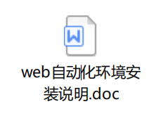

#### App 自动化搭建环境

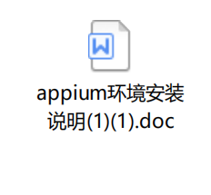

### 设置文件头模板

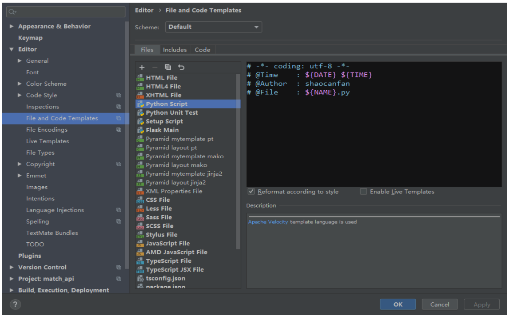

在 python script 中添加

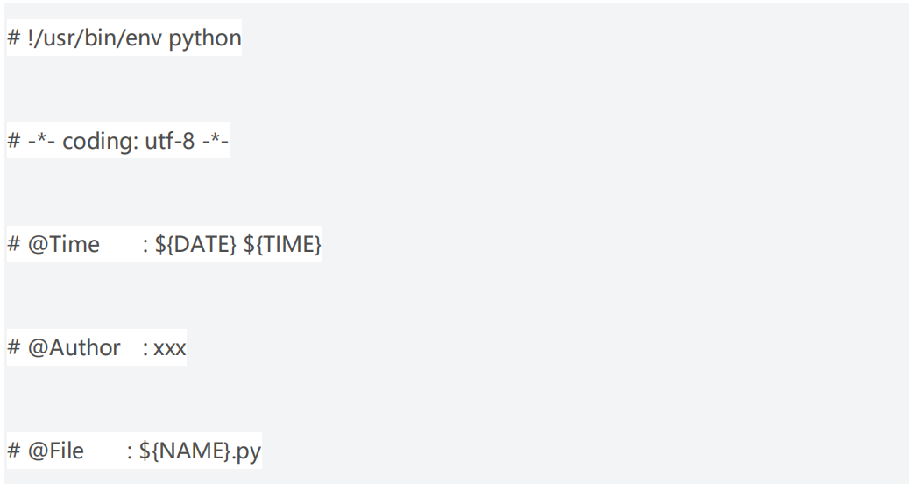

1. #!/usr/bin/env python
2. 让用户可以自行选择 python 版本，用户可以在环境变量中配置自己的 py 解释器（ps：用户
安装的版本默认定位在 linux 的 local 文件夹中）。#!/usr/bin/env python 这行注释，会使 linux
在解析文件时，知道要去使用环境变量中的 py 解释器而非系统自带的那个。
3. 2.# -*- coding:utf-8 -*-
4. 它的作用：在 Linux 下指定文件的编码方式,用于支持中文。
5. python2 需要在首行写-*- coding:utf-8 -*-才能支持中文，python3 开始默认支持中文了，
就可以省去这行注释。

### 测试目录结构

按层级类型划分并统一命名为：

公共类文件：common

页面类文件:pages

数据类文件:test_data

报告类文件：report

运行类文件直接放在项目根目录下：`run.py`

### 测试用例规范

一、测试用例一般多用在调试的时候：

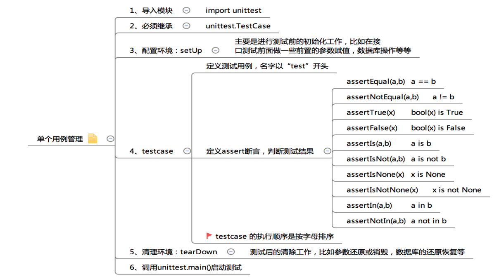

代码示例：

```
    # -*- coding:utf-8 -*-
    # 用例执行

    # 1、导入模块
    import unittest

    # 2、继承自 unittest.TestCase 类
    class TestOne(unittest.TestCase):

    # 3、配置环境：进行测试前的初始化工作
    def setUp(self):
    print '\ncases before'pass

    # 4、定义测试用例，名字以“test”开头
    def test_add(self):
    '''test add method'''
    print 'add...'
    a = 3 + 4
    b = 7

    # 5、定义 assert 断言，判断测试结果
    self.assertEqual(a, b)
    def test_sub(self):
    '''test sub method'''
    print 'sub...'
    a = 10 - 5
    b = 4
    self.assertEqual(a, b)

    # 6、清理环境
    def tearDown(self):
    print 'case after'
    pass

     # 7、该方法会搜索该模块下所有以 test 开头的测试用例方法,并自动执行它们
    if __name__ == '__main__':
    unittest.main()
```

### 代码布局

* 缩进。4 个空格的缩进，不使用 Tab，更不能混合使用 Tab 和空格。
* 每行最大长度 79，换行可以使用反斜杠，最好使用圆括号。换行点要在操作符的后边敲
回车。
* 顶层函数和类之间使用两个空行。
* 类的方法之间使用一个空行。
* （谨慎地）使用额外的空白行来分隔一组相关的函数。一堆相关的单行代码之间的空白行
可以省略（例如，一组 dummy implementations）。
* 在函数中使用空行来（谨慎地）表示不同的逻辑段落。

### 编码

* Python 3.0 和以后的版本，首选 UTF-8

### 导入

* 导入通常应当使用单独的行
* 导入位于文件的顶部，在模块注释和文档字符串之后，在模块的全局变量与常量之前。
* 导入应该按照以下的顺序分组：
* standard library imports 标准库导入
* related third party imports 相关第三方导入
* local application/library specific imports 本地应用程序/库的特定导入
* 每组导入之间使用空行隔开。
* 在导入之后放置任何相关的 all 说明书。
* 非常不推荐在包内导入中使用相对路径导入。对所有导入来说，总是使用绝对包路径导
入。

### 文档编排

模块内容的顺序

* 模块说明和 docstring—import—globals&constants—其他定义。
* 其中 import 部分，又按标准、第三方和自己编写顺序依次排放，之间空一行。
* 不要在一句 import 中多个库，比如 import os, sys 不推荐。
* 如果采用 from XX import XX 引用库，可以省略‘module.’，都是可能出现命名冲突，
这时就要采用 import XX。

### 空格的使用

* 总体原则，避免不必要的空格。
* 括号里边避免空格。
* 逗号、冒号、分号前不要加空格。
* 函数的左括号前不要加空格。如 Func(1)。 *索引操作中的冒号当作操作符处理前后要有同样的空格(一个空格或者没有空格）
* 操作符左右各加一个空格，不要为了对齐增加空格。
* 函数调用的左括号之前不能有空格
* 二元运算符两边放置一个空格
* 不要将多句语句写在同一行，尽管使用‘;’允许。
* 通常不推荐复合语句(Compound statements: 多条语句写在同一行)。

### 注释

* 不好理解的注释不如没有注释。注释要和代码保持与时俱进！
* 注释应该是一条完整的句子。如果注释是一个短语或句子，它的第一个字应该大写，除非
它是一个小写字母开头的标识符（绝对不要改变标识符的大小写）。
* 如果注释很短，那么结尾的句号可以省略。块注释通常由一个或多个段落组成， 这些段
落由完整的句子构成，每个句子都应该使用句号结尾。
* 句号结尾的句子后面应该有 2 个空格。
* 来自非英语国家的 Python 程序员：请使用英语写注释，除非你 120％肯定你的代码将永
远不会被不说你的语言的人阅读。
* 块注释在一些（或全部）代码之前，并和代码缩进一致。每行注释均以 # 开头，然后紧
跟一个空格（除非在注释内缩进）
* 块注释内的段落使用仅含 # 的单行分隔。
* 谨慎地使用内嵌注释：内嵌注释是一种和语句在同一行的注释。内嵌注释至少和语句间隔
2 个空格。他们开始于一个 # 和一个空格。
* 如果语句显而易见，那么内嵌注释是不必要的，实际上会让开发者分心。
* 所有的 Public 模块，函数，类和方法都需要编写文档字符串。对非公共的方法而言，文
档字符串则不是必要的，但是可以使用一个注释来描述这个方法。这个注释必须位于 def 行之后。
* 注意最重要的是，””” 作为多行的文档字符串的结束，应该单独一行
* 对单行的文档字符串来说，结尾的 “”” 在同一行。

### 命名规范

1. 总体原则，新编代码必须按下面命名风格进行，现有库的编码尽量保持风格。
2. 永远不要使用 ‘l’（小写的 L），’O’（大写的 O），或者’I’（大写的 I）作为单字变量名。
在某些字体中，这些字很难和数字的 0 和 1 区分。当打算用’l’的时候,用’L’来代替。
3. 模块应该用简短的，全小写的名字。如果能增强可读性的话，可以使用下划线。
4. Python 的包也要用全小写的，短名称，但是不建议用下划线。
5. 类的命名使用 CapWords 的方式，模块内部使用的类采用_CapWords 的方式。
6. 异常也是类，所以这里也用类名规则。但是，你异常名应该用后缀 “Error”（如果你的异常
确实是个错误的话）。
7. 被设计为通过 from M import *导入的模块。
8. 函数名应该用小写，为了增加可读性可以用下划线分隔。
9. 全局变量名(我们希望这些变量只在模块内部使用)和函数规则一样。
10. 始终用 self 作为实例方法的第一个参数。
11. 始终用 cls 作为类方法的第一个参数。
12. 如果函数的参数名和保留字冲突。用结尾下划线比缩写或是滥用的组词更好。因此 class比 clss 好。（也许，更好的避免冲突的方式是用同义词。）
13. 方法名和实例变量：使用函数命名规则：使用下划线分隔的小写字母会提高可读性。
14. 只在私有方法和实例变量前用单下划线。
15. 常量通常在模块级别中定义，用全大写和下划线分隔的字符来编写。例如
MAX_OVERFLOW 和 TOTAL。

### 文档描述

1. 为所有的共有模块、函数、类、方法写 docstrings；非共有的没有必要，但是可以写
注释（在 def 的下一行）。
2. 如果 doc string 要换行，
"""Return a foobang
Optional plotz says to frobnicate the bizbaz first.
"""

### 测试报告规范

生成测试报告：

1. 安装 HTMLTestRunner HTMLTestRunner 是 Python 标准库的 unittest 模块的一个扩
展，它可以生成 HTML 的 测试报告。
2. 测试脚本中引入from HTMLTestRunner import HTMLTestRunner
3. 定义测试报告的路径，调用 HtmlTestRunner
4. 执行测试脚本，打印测试报告，生成 html。
5. 再次执行测试脚本，生成测试报告。

### 测试内容报告内容

1. 报告标题
2. 当前硬件环境：机型，型号
3. 当前软件环境：系统，版本
4. 当前网络环境：WiFi 或 4G
5. 运行时长：所以用例运行总时长，单个用例运行时常
6. 每个用例运行情况及详细运行信息
