<!--
 * @Descripttion: UI规范
 * @Author: zmlxsg
 * @Date: 2021-08-24 10:20:59
 * @LastEditors: zmlxsg
 * @LastEditTime: 2021-08-30 10:01:45
-->

# UI规范

## 背景

针对现有的 「 系统后台 1.0 / 移动护理 PC 2.0 / 平台管理 1.0 / 主索引管理 1.0」 4个web端后台管理系统，进行UI设计统一，因此，整合UI设计规范。

## 应用

统一进行调整现有平台，或下一个版本进行迭代 仅做参考，具体设计还需根据需求内容尺寸进行定义。

## 现有4个系统后台（展示为部分界面）

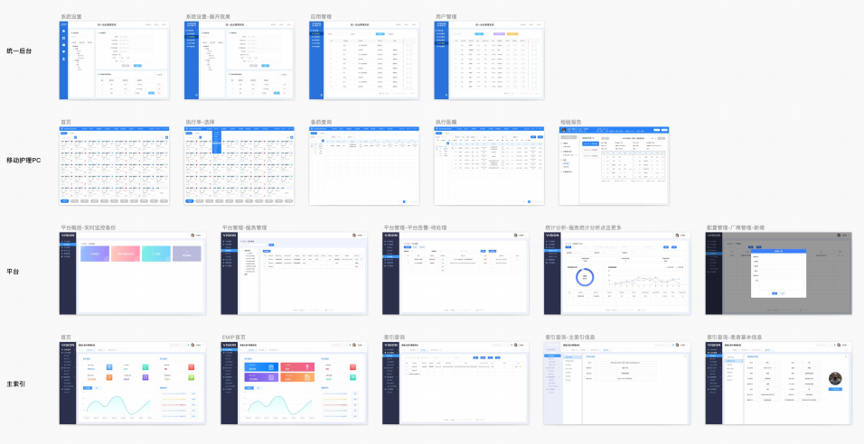

### 公司logo

* 调整前： 中英文大小不一、高度不一、间距不统一、“信” 太靠右，与“V”间距太大，导致整体重心不稳。
* 调整后： 中英文高度一致，各英文间距一致，各中文间 距一致，中英文之间间距调大，保留呼吸感， 缩小“医”的高度，与其视觉上形成统一，不再 突兀，“信”往左移出一些，使整体重心更稳。

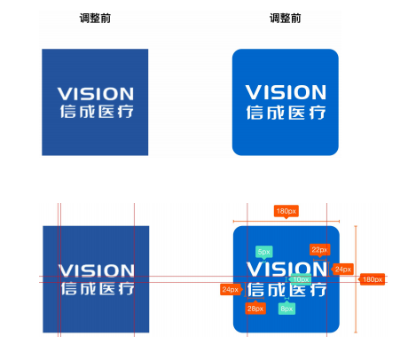

### 颜色

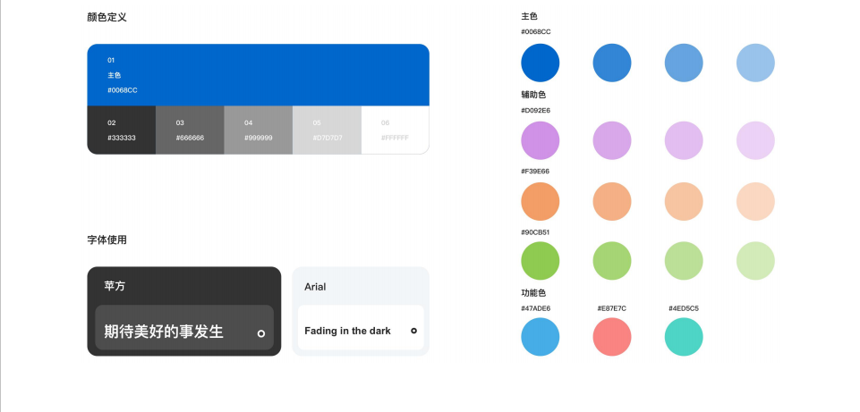

### 字体

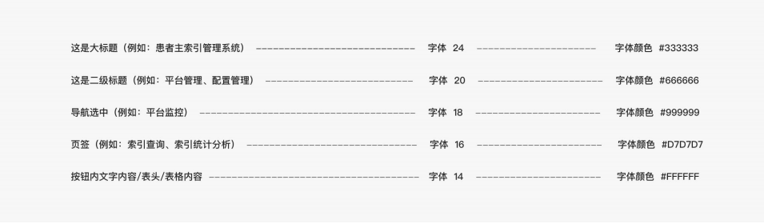

### 布局

#### 通用框架（页签在里）

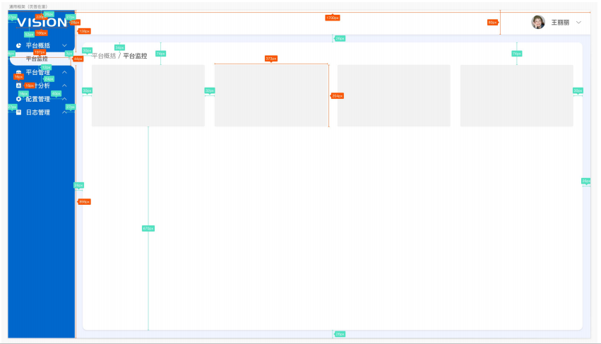

#### 通用框架（页签在外）

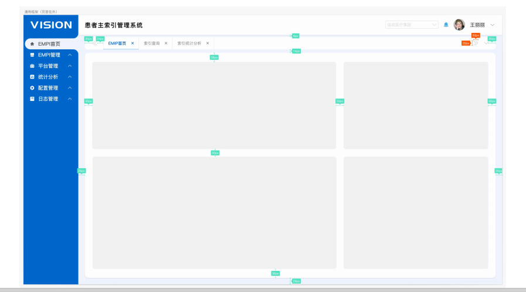

### 按钮

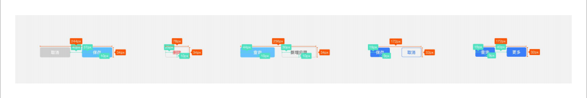

### 输入框

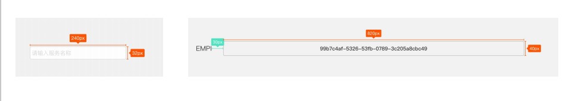

### 单选框

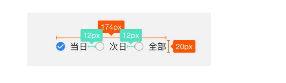

### 多选框

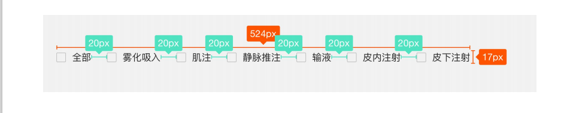

### 图标

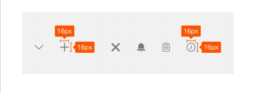

### 开关

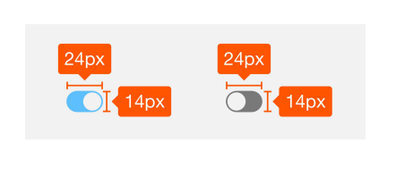

### 日期选择器

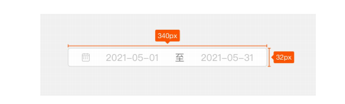

### 表单

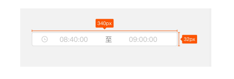

### 表格

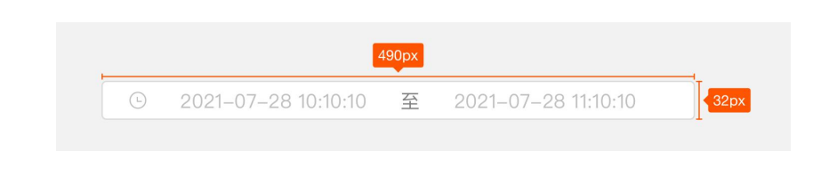

### 分页

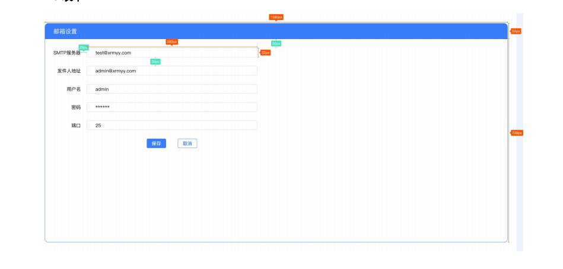

### 表 格

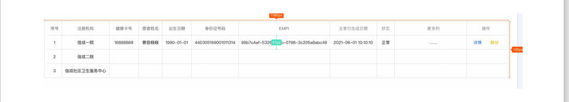

### 分 页

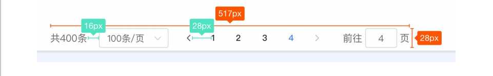

### 标签

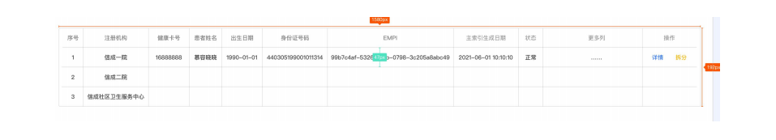

### 头像

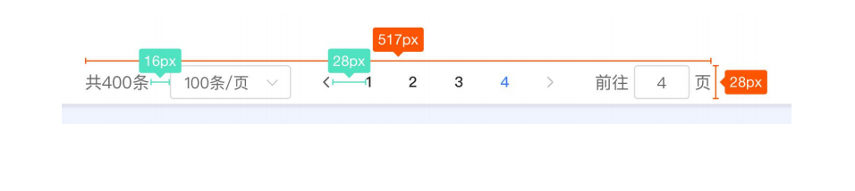

### 警告

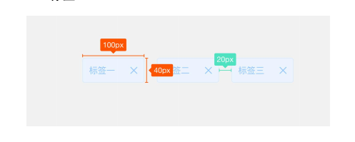

### 弹窗

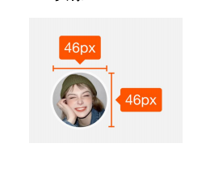

### 导航菜单

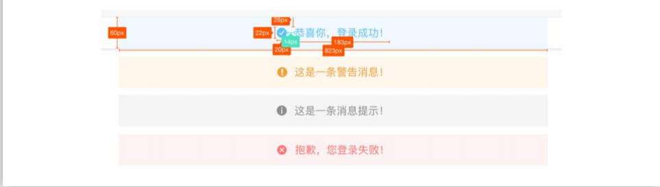

### 标签页

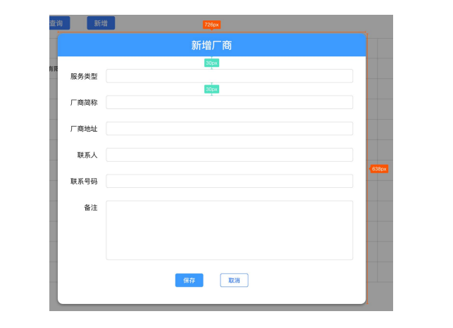

### 步骤条

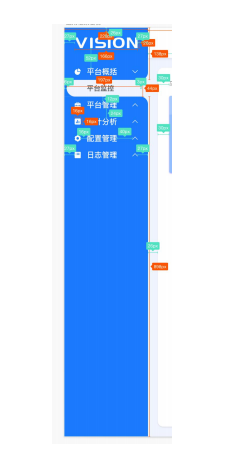

### 面包屑

### 下拉菜单

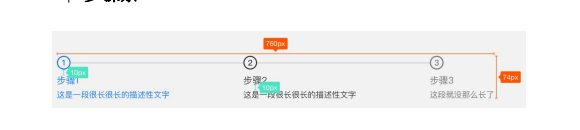

### 图片

### 进度条

![进度条]](../img/ui-29.png)

### 缺省页

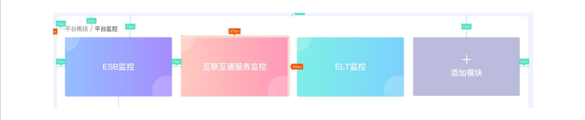
